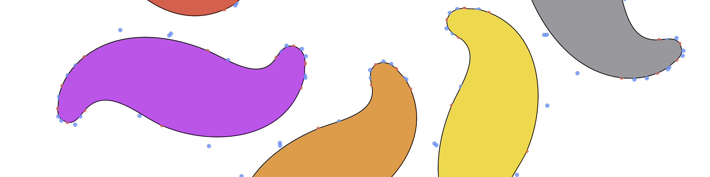

# NDGeometry

[](https://github.com/davidcvasquez/NDGeometry/actions/workflows/swift.yml) [](https://codecov.io/gh/davidcvasquez/NDGeometry)



A collection of Swift geometry types suitable for calculations on background threads, an extension of `CGAffineTransform` that provides X and Y shear transforms, and curve fitting of one or more cubic Bézier segments to a polyline. 

All of the geometry types are `Sendable` for concurrency, `Codable` for storage, and `Hashable` for use as keys.

Most types closely follow the design of types provided by the CoreGraphics library, but are separate types that are not directly assignable without using conversions.

The `NDFloat` type is a direct type alias and extension of the `CGFloat` type.

## Details

The NDGeometry library provides the following types\:

- `NDFloat` An extended version of `CGFloat`.
- `NDAngle` An extended version of the SwiftUI `Angle` type, which is a geometric angle whose value you access in either radians or degrees.
- `NDPoint` A nonisolated version of `CGPoint`, with convenient constants and common calculations.
- `NDPolarPoint` A polar point represented as a radius or distance to the pole (ρ) and an angle (θ).
- `NDVector` A nonisolated version of `CGVector`, with conveniences.
- `NDSize` A nonisolated version of `CGSize`, with conveniences.
- `NDRect` A nonisolated version of `CGRect`, with conveniences.

The SwiftUI `Path` type is also extended to provide curve fitting of one or more cubic Bézier segments to a polyline, using the classic Schneider “FitCurves” approach from Graphics Gems.

The `CGAffineTransform` type is extended to provide X and Y shear transforms using angles, which are clamped to +/- 85 degrees by default.

## Usage

All of the geometry types have accessors that convert to a corresponding CoreGraphics type. For example, `NDPoint` provides a `cgPoint` converter\:

```Swift
    /// - Returns: This point converted to a CGPoint.
    @inlinable
    public var cgPoint: CGPoint {
        CGPoint(x: x, y: y)
    }
```

Convenience initializers are also provided to initialize an NDGeometry type from its corresponding CoreGraphics type, as shown here for `NDPoint`\:

```Swift
    /// Initializer from a CGPoint.
    @inlinable
    public init(_ p: CGPoint) {
        self.init(x: p.x, y: p.y)
    }
```

## Supported Versions

The minimum Swift version supported by NDGeometry is 5.9.

## Reference

See also the [reference documentation](https://davidcvasquez.github.io/NDGeometry/).
